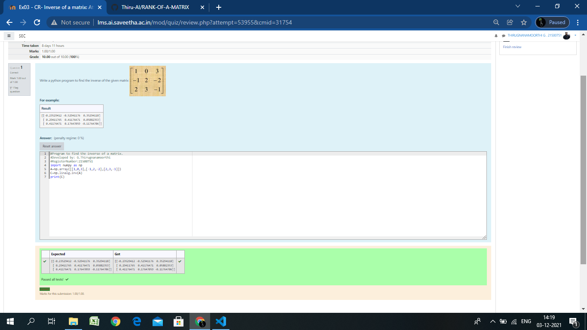

# INVERSE-OF-A-MATRIX
## Aim:
To write a python program to find the inverse of a matrix
## Equipment’s required:
1. 	Hardware – PCs
2. 	Anaconda – Python 3.7 Installation / Moodle-Code Runner
## Algorithm:
### Step1 : 
we can use the numpy function

### Step 2: 
using given values,create np.array and mark it as 'A'

### Step 3:
 Using the np.linalg.inv(A) and name it as'B',we can find the rank of the given matrix

### Step 4: 
print'B' and end the programme

## Program:
~~~import numpy as np
A=np.array([[1,0,3],[-1,2,-2],[2,3,-1]])
C=np.linalg.inv(A)
print(C)
~~~

## Output:

## Result:
Thus the inverse of given matrix is successfully solved using python program

